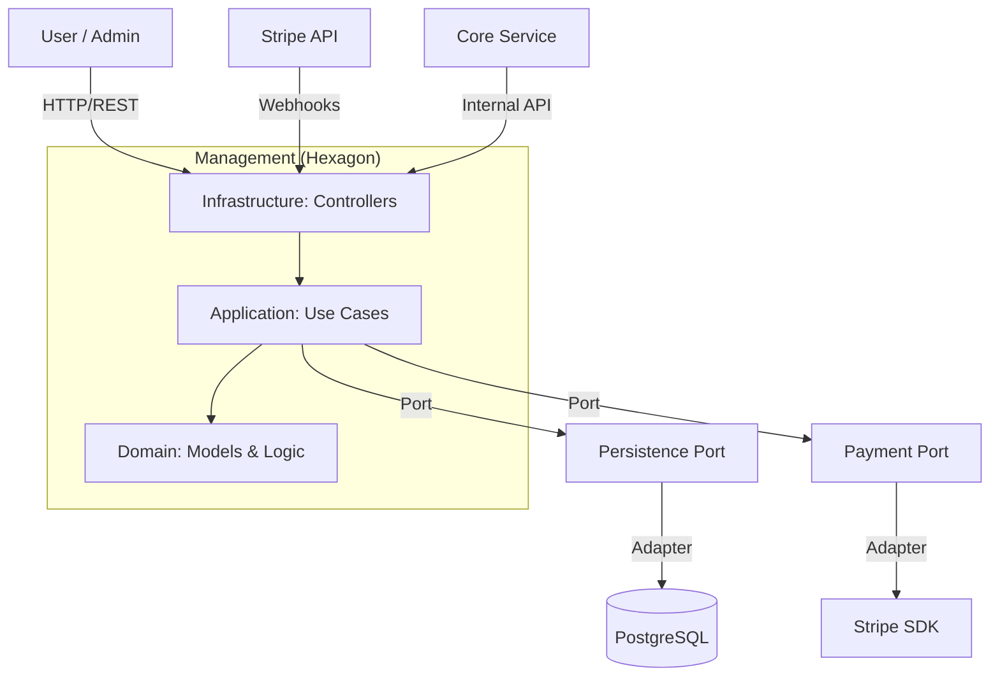
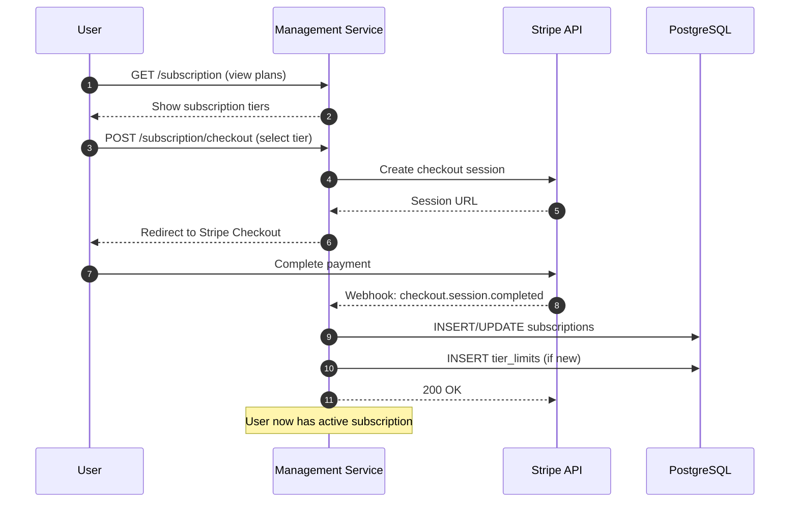
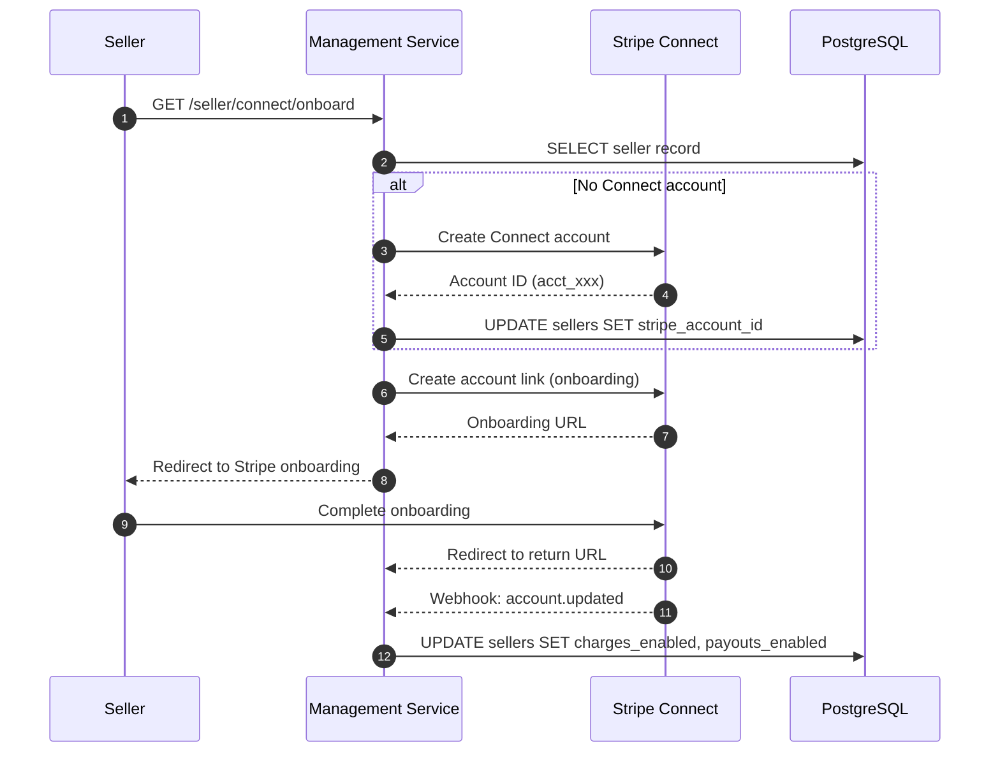
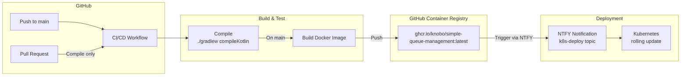

# Simple Queue Management — Architecture

*Service: management.knobo.no*  
*Repository: simple-queue-management*  
*Updated: 2026-02-05*

---

## Overview

Simple Queue Management is the **business operations microservice** responsible for user management, subscriptions, payments, seller onboarding, and Stripe Connect integration. It is one of two services in the Simple Queue microservices architecture.

### Service Boundary

**Management owns the "Who" and "Subscription/Payment" state:**
- User subscriptions and tier management
- Stripe payment processing (checkout, billing)
- Stripe Connect (seller onboarding, payouts)
- Organization and seller management
- Referral tracking and commissions
- Tier limits configuration (superadmin)
- Subscription quota enforcement

**Management does NOT own:**
- Queue operations (Core)
- Ticket lifecycle (Core)
- Real-time display (Core)
- Counter operations (Core)

---

## System Architecture

The application follows a strict **Hexagonal Architecture** enforced by Gradle modules:



### Module Structure
- **`domain`**: Pure Kotlin business logic. Entities (`Subscription`, `Seller`, `Organization`), Value Objects (`CommissionRate`), and Port interfaces.
- **`application`**: Use Cases (`CreateSellerUseCase`, `ProcessSubscriptionWebhook`) that orchestrate domain logic.
- **`infrastructure`**: Spring Boot 3.3 application, Controllers, and Adapters (`JdbcRepository`, `StripeConnectAdapter`, `KeycloakAdapter`).

---

## Integration Points

### 1. Shared Database

Both services share a PostgreSQL database. This is a **transitional architecture**.

| Aspect | Details |
|--------|---------|
| **Database** | PostgreSQL 15+ |
| **Schema** | `public` (shared) |
| **Migrations** | Flyway, managed by both services |

**Management-owned tables:**
- `subscriptions` — User subscription records
- `tier_limits` — Configurable tier limits
- `sellers` — Seller/partner profiles
- `seller_referrals` — Referral tracking
- `seller_payouts` — Payout records
- `commission_entries` — Commission calculations
- `organizations` — Organization data

**Core-owned tables (read-only access for quota checks):**
- `queues` — For counting user's queues
- `queue_members` — For counting operators

### 2. Internal API for Core

Management exposes an internal REST API for Core to check quotas and subscriptions.

**Base Path:** `/api/internal/subscription`

| Endpoint | Description |
|----------|-------------|
| `GET /{userId}/quota` | Full quota and subscription info |
| `GET /{userId}/can-create-queue?currentQueueCount=X` | Check queue creation allowed |
| `GET /{userId}/can-invite-operator?currentOperatorCount=X` | Check operator invite allowed |
| `GET /{userId}/can-add-counter?currentCounterCount=X` | Check counter add allowed |
| `GET /{userId}/can-issue-ticket?ticketsIssuedToday=X` | Check ticket issuance allowed |
| `GET /{userId}/tier` | Get subscription tier only |

**Security:** Currently assumes same-cluster access. Future: API key authentication.

### 3. Stripe Integration

#### Stripe Payments (Subscriptions)

| Component | Purpose |
|-----------|---------|
| `StripePaymentGateway` | Process subscription payments |
| `StripeWebhookController` | Handle Stripe webhooks |
| `SubscriptionController` | Manage user subscriptions |

**Events handled:**
- `checkout.session.completed` — New subscription
- `invoice.paid` — Recurring payment success
- `invoice.payment_failed` — Payment failure
- `customer.subscription.deleted` — Cancellation

#### Stripe Connect (Seller Marketplace)

| Component | Purpose |
|-----------|---------|
| `StripeConnectAdapter` | Seller onboarding and payouts |
| `SellerConnectController` | Connect account management |
| `StripeConnectWebhookController` | Connect-specific webhooks |

**Events handled:**
- `account.updated` — Seller account status changes
- `payment.created` — Commission-eligible payment
- `transfer.paid` — Payout to seller

### 4. Redirects to Core

Queue-specific UI paths redirect to Core service.

| Path | Redirects To |
|------|--------------|
| `/dashboard` | `https://queue.knobo.no/dashboard` |
| `/queue/{queueId}/**` | `https://queue.knobo.no/queue/{queueId}` |
| `/q/**` | `https://queue.knobo.no/q` |

Implemented by `QueueCoreRedirectController`.

---

## Data Flow: Subscription Creation



---

## Data Flow: Seller Onboarding



---

## CI/CD Pipeline



### GitHub Actions Workflow

**File:** `.github/workflows/ci-cd.yaml`

| Stage | Description |
|-------|-------------|
| **Compile** | `./gradlew compileKotlin bootJar -x test` — Build only (tests TODO) |
| **Build** | Docker build with Spring Boot layered JAR |
| **Push** | Tag and push to GHCR (`ghcr.io/knobo/simple-queue-management:latest`) |
| **Notify** | POST to `ntfy.knobo.no/k8s-deploy` with commit message |

### Kubernetes Deployment

The NTFY notification triggers a Kubernetes rolling update.

```yaml
# Deployment spec (simplified)
apiVersion: apps/v1
kind: Deployment
metadata:
  name: simple-queue-management
  namespace: queue
spec:
  replicas: 1
  template:
    spec:
      containers:
        - name: app
          image: ghcr.io/knobo/simple-queue-management:latest
          imagePullPolicy: Always
```

---

## Subscription Tiers

| Feature | FREE | STARTER | PRO | ENTERPRISE |
|---------|------|---------|-----|------------|
| **Max Queues** | 1 | 3 | 10 | Unlimited |
| **Max Operators/Queue** | 0 | 2 | 10 | Unlimited |
| **Max Counters/Queue** | 1 | 3 | 10 | Unlimited |
| **Max Tickets/Day** | 50 | 200 | Unlimited | Unlimited |
| **Email Notifications** | ❌ | ✅ | ✅ | ✅ |
| **Custom Branding** | ❌ | ❌ | ✅ | ✅ |
| **Analytics** | ❌ | ❌ | ✅ | ✅ |
| **API Access** | ❌ | ❌ | ❌ | ✅ |

Tier limits are configurable by superadmin via `/admin/tier-limits`.

---

## Stripe Configuration

### Environment Variables

| Variable | Description | Required |
|----------|-------------|----------|
| `STRIPE_SECRET_KEY` | Stripe API secret key | Yes |
| `STRIPE_PUBLISHABLE_KEY` | Stripe publishable key | Yes |
| `STRIPE_WEBHOOK_SECRET` | Webhook signing secret (subscriptions) | Yes |
| `STRIPE_CONNECT_WEBHOOK_SECRET` | Webhook signing secret (Connect) | Yes |
| `STRIPE_PRICE_STARTER` | Price ID for STARTER tier | Yes |
| `STRIPE_PRICE_PRO` | Price ID for PRO tier | Yes |
| `STRIPE_PRICE_ENTERPRISE` | Price ID for ENTERPRISE tier | Yes |

### Webhook Endpoints

| Endpoint | Purpose |
|----------|---------|
| `POST /webhooks/stripe` | Subscription events |
| `POST /webhooks/stripe-connect` | Connect marketplace events |

---

## Configuration

### Environment Variables

| Variable | Description | Required | Default |
|----------|-------------|----------|---------|
| `DATABASE_URL` | PostgreSQL JDBC URL | No | `jdbc:postgresql://localhost:5432/simplequeue` |
| `DATABASE_USERNAME` | Database user | No | `user` |
| `DATABASE_PASSWORD` | Database password | Yes | - |
| `KEYCLOAK_AUTH_SERVER_URL` | Keycloak URL | Yes | - |
| `KEYCLOAK_REALM` | Keycloak realm | Yes | `simple-queue` |
| `KEYCLOAK_CLIENT_ID` | OAuth client ID | Yes | - |
| `KEYCLOAK_CLIENT_SECRET` | OAuth client secret | Yes | - |
| `STRIPE_SECRET_KEY` | Stripe API key | Yes | - |
| `STRIPE_WEBHOOK_SECRET` | Stripe webhook secret | Yes | - |
| `APP_BASE_URL` | Public URL | No | `https://management.knobo.no` |
| `SMTP_HOST` | SMTP server | No | `localhost` |
| `SMTP_PORT` | SMTP port | No | `587` |

---

## Keycloak Integration

| Setting | Value |
|---------|-------|
| **URL** | https://login.knobo.no |
| **Realm** | `simple-queue` |
| **Client ID** | `web` |

### Roles Used by Management

| Role | Description | Access |
|------|-------------|--------|
| `superadmin` | Platform admin | Tier limits, all sellers, analytics |
| `seller` | Partner/Seller | Seller dashboard, referral tracking |
| `queue-owner` | Queue owner | Subscription management |

---

## API Endpoints

### Public Endpoints
- `GET /subscription` — View subscription plans
- `POST /subscription/checkout` — Start checkout
- `GET /subscription/success` — Checkout success callback
- `GET /subscription/cancel` — Checkout cancel callback

### Seller Endpoints (Auth Required)
- `GET /seller/dashboard` — Seller dashboard
- `GET /seller/connect/onboard` — Start Stripe Connect onboarding
- `GET /seller/connect/refresh` — Refresh onboarding link
- `GET /seller/connect/return` — Onboarding return URL

### Admin Endpoints (Superadmin Only)
- `GET /admin/tier-limits` — View/edit tier limits
- `GET /admin/sales` — Sales dashboard

### Internal API (Core Service)
- `GET /api/internal/subscription/{userId}/quota` — Full quota
- `GET /api/internal/subscription/{userId}/can-create-queue` — Queue check
- `GET /api/internal/subscription/{userId}/can-invite-operator` — Operator check
- `GET /api/internal/subscription/{userId}/can-add-counter` — Counter check
- `GET /api/internal/subscription/{userId}/tier` — Tier only

### Webhook Endpoints
- `POST /webhooks/stripe` — Stripe subscription webhooks
- `POST /webhooks/stripe-connect` — Stripe Connect webhooks

### Redirect Endpoints
- `GET /dashboard` → Core service
- `GET /queue/{queueId}/**` → Core service
- `GET /q/**` → Core service
